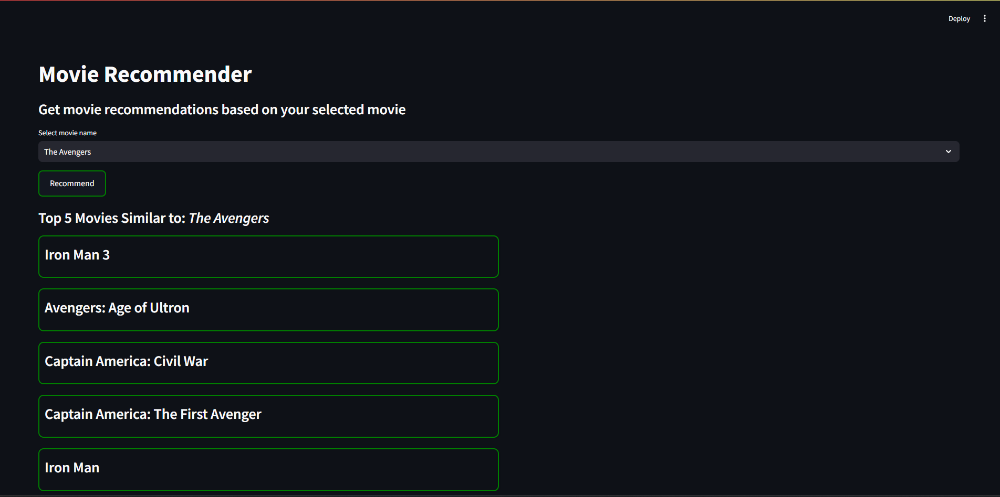

# Movie Recommendation System

## About
An interactive content-based movie recommendation system that suggests similar movies based on user input. This project combines natural language processing, machine learning, and a user-friendly interface to deliver personalized movie recommendations.

## Methodology
1. Data Preprocessing:
    * Handled missing values and duplicates.
    * Extracted and processed JSON-like features (genres, keywords, cast, crew) into usable formats.
    * Unified features into a tags column by combining processed attributes like overview, genres, keywords, cast, and crew.

2. Feature Engineering:
    * Used CountVectorizer with Bag of Words to convert text-based tags into numerical vectors.
    * Limited the vocabulary to the 5000 most frequent words, excluding stop words for efficiency.
    * Applied stemming to standardize word forms and reduce dimensionality.

3. Similarity Calculation:
    * Built a cosine similarity matrix to compute pairwise similarity between movie vectors.

4. Recommendation Model:
    * Designed a function to fetch the top 5 movies most similar to the selected movie based on cosine similarity.

5. User Interface:
    * Built a Streamlit app to provide a simple and interactive UI for users to select movies and view recommendations in real-time.
